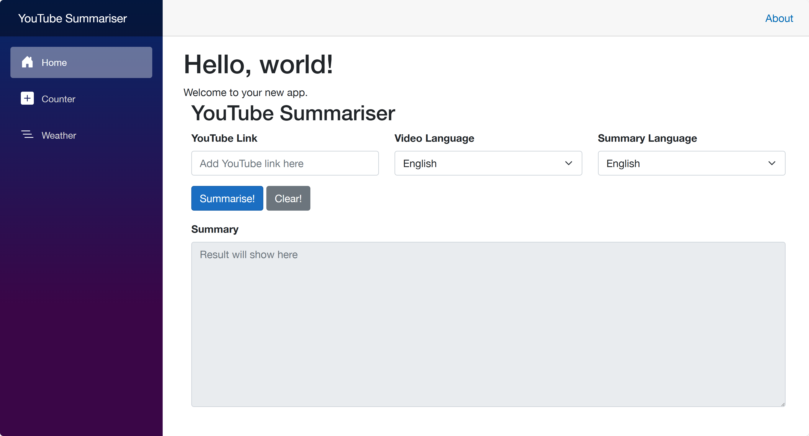
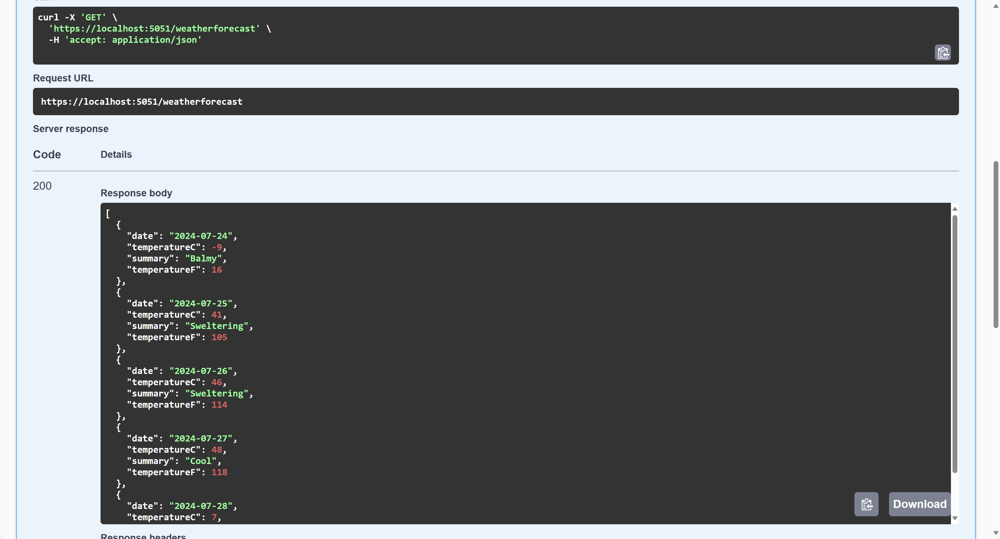

# 사전 워크샵 과제

해커그라운드 2024 사전워크샵에 참석하신 여러분을 환영합니다!

여러분은 이번 사전 워크샵을 통해 아래와 같은 내용을 실습했습니다.

1. .NET Aspire를 활용한 클라우드 네이티브 앱 개발​
1. Azure OpenAI와 Semantic Kernel을 이용한 지능형 웹 개발​
1. Azure Bicep과 GitHub Actions를 활용한 플랫폼 엔지니어링 기초​

이제 이번 사전 워크샵을 통해 배운 내용을 바탕으로 아래 과제를 수행해 주세요. 과제를 통해 배운 내용을 복습하고, 실제로 구현해 보는 경험을 통해 더욱 실력을 향상시킬 수 있습니다. 실제로 사전 워크샵에서 실습했던 내용을 활용하기만 하면 과제를 완료할 수 있습니다.

## 과제

> GitHub Copilot을 마음껏 활용하셔도 됩니다.

1. .NET Aspire를 활용해서 프론트엔드 앱과 백엔드 API 앱을 개발하고 Azure Container Apps 서비스에 배포해 주세요.

   - 프론트엔드 앱: `frontend` 디렉토리 아래 Blazor로 개발합니다.
     - 홈페이지에서 질문을 입력하고 결과를 표시하는 화면을 구성합니다.
     - 화면 UI는 자유롭게 구성하되 질문을 입력하고 결과를 표시할 수 있어야 합니다.

       > **중요**: 반드시 아래 다섯 가지 요소를 반드시 포함해야 합니다.

       - YouTube 링크: `<input id="youtube-link" />`,
       - 비디오 언어: `<select id="video-language-code"></select>`,
       - 요약 언어: `<select id="summary-language-code"></select>`
       - 요청: `<button id="summary">Summary</button>`,
       - 답변: `<textarea id="result"></textarea>`

     - `Summary` 버튼을 클릭하면, 백엔드 API 앱의 `/summarise` 엔드포인트를 호출해서 결과를 화면에 표시해야 합니다.

     - 예시 화면:

       

   - 백엔드 API 앱: `backend` 디렉토리 아래 ASP.NET Core Web API로 개발합니다.
     - `/weatherforecast` 엔드포인트를 구현합니다.

     - 예:

        **요청**

        ```bash
        curl -X GET \
            -H "Content-Type: application/json" \
            https://my-backend-api.koreacentral.azurecontainerapps.io/weatherforecast
        ```

        **응답**

        ```json
        [
          {
            "date": "2024-07-24",
            "temperatureC": -9,
            "summary": "Balmy",
            "temperatureF": 16
          },
          {
            "date": "2024-07-25",
            "temperatureC": 41,
            "summary": "Sweltering",
            "temperatureF": 105
          },
          {
            "date": "2024-07-26",
            "temperatureC": 46,
            "summary": "Sweltering",
            "temperatureF": 114
          },
          {
            "date": "2024-07-27",
            "temperatureC": 48,
            "summary": "Cool",
            "temperatureF": 118
          },
          {
            "date": "2024-07-28",
            "temperatureC": 7,
            "summary": "Freezing",
            "temperatureF": 44
          }
        ]
        ```

     - 예시 화면:

       

1. Azure Bicep과 GitHub Actions를 활용해서 빌드 및 배포 자동화를 구성해 주세요.

   - 자신의 GItHub 리포지토리를 생성하고 코드를 커밋
   - 코드 커밋/푸시 이벤트가 발생하면 GitHub Actions를 통해 Azure Bicep을 이용해서 인프라를 생성하고 .NET Aspire 앱을 배포'
   - Azure 배포를 위한 리소스 그룹 이름은 `rg-{{자신의 GitHub ID}}`입니다.

1. 배포 성공 후 https://hackersground.kr 에서 아래 내용을 [이슈](https://github.com/hackersground-kr/hackers-ground/issues/new/choose)로 제출해 주세요.

   > **과제 제출 양식**은 아래와 같습니다. 반드시 지켜 주세요.

   - GitHub 리포지토리 URL - **반드시 public 리포지토리로 설정**
   - Azure Container Apps 서비스 URL - **프론트엔드 앱 URL**, **백엔드 API 앱 URL**, **대시보드 앱 URL**

1. 이슈 생성후 검증단이 직접 확인하고, 성공적으로 배포하고 프론트엔드/백엔드 앱이 작동하는 경우에 한해 과제 완료로 처리합니다.
